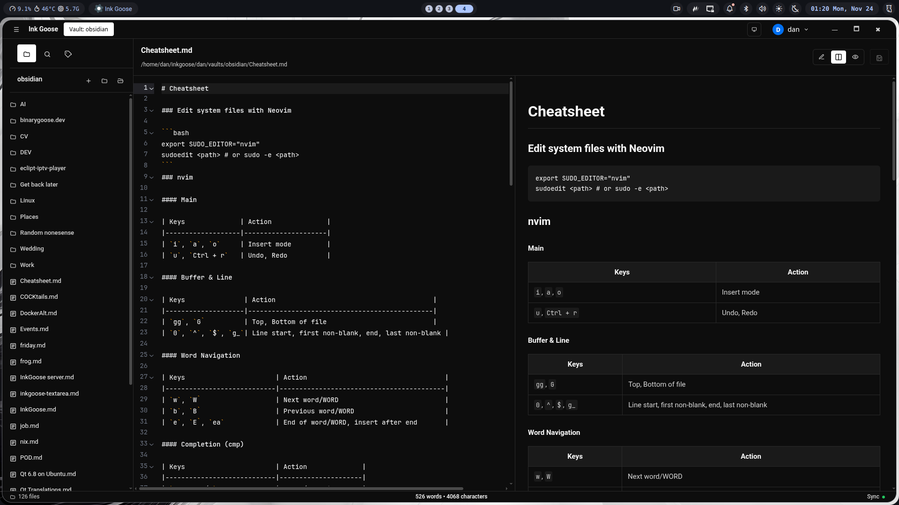

# Ink Goose

**Ink Goose** is markdown-based note-taking app. It aims to provide a simple environment for organizing, writing, and managing notes.

> ⚠️ **App is in early development**
>
> - Features may be incomplete or unstable.  
> - Sync and encryption are far from finished state. Do not use the app for any sensitive info.




---

## Features

- Create and edit notes
- Organize notes in folders
- Local file storage
- Sync and encryption (WIP)

---

## Planned features

- Strict and standard encryption modes.
- Manual/auto conflict resolution
- Theming
- Self-hosted backend
- Built-in `git` support

## Build and run

1. Install dependencies:

```bash
npm install
```

2. Run:

```bash
npm start
```

3. Build:

```bash
npm run package
```